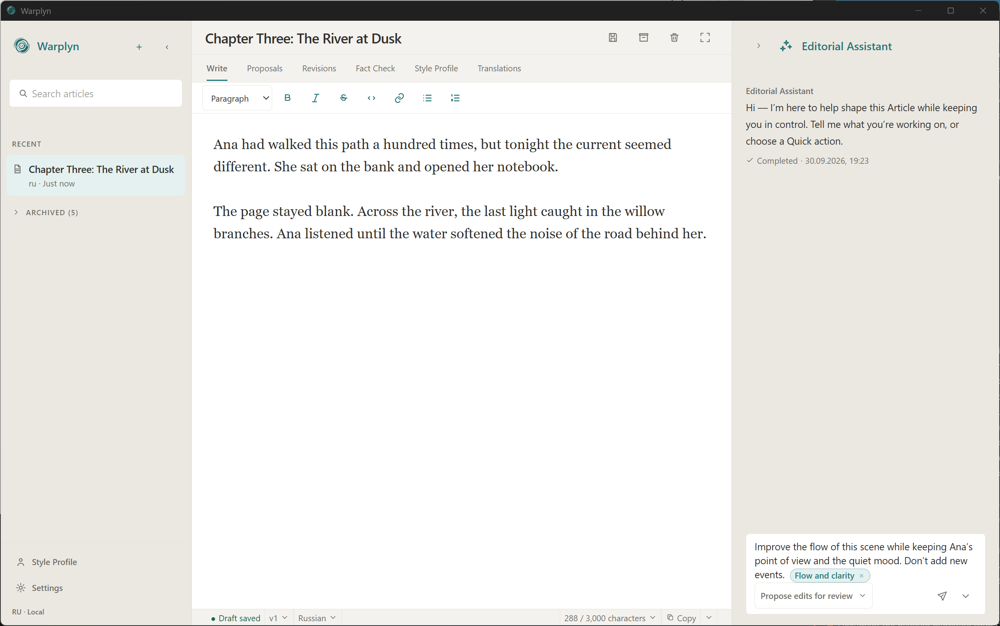

# Warplyn

> Your writing. Your voice. Your agent.

Warplyn is an open-source, local-first desktop AI writing workspace where an Editorial Assistant helps you develop and revise your Articles. You decide what changes.

[Download for Windows or Debian Linux](https://github.com/punk-link/warplyn/releases/latest) · [Installation guide](https://warplyn.com/docs/installation.html) · [Website](https://warplyn.com/)

## Built around the Author

Warplyn is built around Authors' needs and the work that goes into their writing. The Author approves changes, keeps the revision history, and decides when and where to publish.

Warplyn aims to make AI assistance approachable without requiring AI infrastructure expertise. To get started today, install the desktop app and connect a supported AI provider with your API key. Choose among supported providers and models to suit your work and budget; available editorial operations depend on the model's capabilities.

Warplyn is MIT-licensed, so you can inspect, modify, and share its source. Your Articles stay on your computer; AI requests send the relevant text and context to your chosen provider.

## Write with help, stay in control

Ask the Assistant to develop your talking points into a draft or improve the flow of an existing Article. Select a passage to focus the request, or work on the whole Article.

Review the proposed changes before they enter your writing. Accept the edits you want and reject the rest. Warplyn never changes your Article without your approval.

## Keep your voice

Use samples of your own writing to build a style profile, then ask for feedback against that profile and your Article's style rules. You decide whether a suggestion fits what you mean and how you want to say it.

## Check claims before you share

Request a fact check to see claims that need attention, with sources to help you assess them. Findings are advice, not a guarantee of accuracy, and they leave your text untouched until you choose to make a change.

## Reach readers in another language

Review a proposed translation before accepting it. Each translation becomes a separate Article linked to the original, so you can refine it for its readers without overwriting the source.

## Keep your work and its history

Your Articles and autosaved drafts stay on your computer. Save Revisions as you work; accepted AI edits also create a Revision. You can return to an earlier Revision while keeping the history that came after it.

Choose a backup folder and create manual or daily automatic backups. See [Backups and recovery](https://warplyn.com/docs/backups-and-recovery.html) for details.

AI assistance requires an internet connection and an AI provider connection. When you request it, Warplyn sends the relevant text and context to your chosen provider, whose data policies apply.

## Prepare your Article for publishing

Preview your writing against your publishing preferences and length guidance, then copy it as Markdown or plain text to the platform you use. Warplyn does not publish directly. You handle the final publication.

## Install Warplyn

Warplyn targets **Windows 11 x64 and Linux**. Download the unsigned installers from [Warplyn releases](https://github.com/punk-link/warplyn/releases). Skladno users should follow the [migration guide](site/user-docs/migration.md) and keep their original installation and backups until the restore is verified.

For Debian installation steps, see the [installation guide](https://warplyn.com/docs/installation.html).

Currently supported AI providers:

- OpenAI
- OpenCode Zen
- Anthropic
- Google Gemini API
- xAI Grok
- DeepSeek

Through OpenCode Zen, Authors can also use models from additional vendors available in its catalog. Supported editorial operations depend on the chosen model's capabilities.

To get started on Windows:

1. Open [Warplyn releases](https://github.com/punk-link/warplyn/releases) and download the Windows setup `.exe` from **Assets**.
2. Run the installer and open Warplyn.
3. To use the Editorial Assistant, open **Settings > AI assistant**, add your provider connection and API key, and verify the connection. Your provider's pricing applies.
4. Create an Article and start writing. Set up a backup folder in **Settings > Data & backups** to protect your work.

**Releases are not digitally signed.** Windows may show a SmartScreen warning. Check that you downloaded the installer from the Warplyn repository's release page before continuing.

On Windows, you control update checks, downloads, and restarts in **Settings > About**. If an update causes trouble, follow the [update recovery guide](https://warplyn.com/docs/update-recovery.html).

## Help

- [User documentation](https://warplyn.com/docs/)
- [Report a problem or suggest an improvement](https://github.com/punk-link/warplyn/issues)

## Project history

Warplyn is maintained by [punk-link](https://github.com/punk-link) and includes Skladno's Git history and inherited tags. Download Warplyn installers from the current [Warplyn releases](https://github.com/punk-link/warplyn/releases).

Historical issues, pull-request reviews, and Skladno releases remain in [skladno-legacy](https://github.com/punk-link/skladno-legacy). Active issues moved to this repository through native transfer; see the [issue URL map](docs/development/guides/skladno-to-warplyn-issue-map.md).

## License

[MIT](LICENSE)
